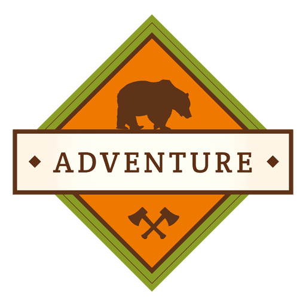

# 🌲⛰️ Nature Adventures  ⛰️🌲

$$
{\color{green}HTML \space and \space CSS \space demonstration \space for \space :}
$$

* nav and links
* pictures with text
* hover
* how to add Google fonts
* how to make element position fixed and absolute
* grid
* responsive design

🌲🌲
- Pictures are from Pixabay and CleanPNG.